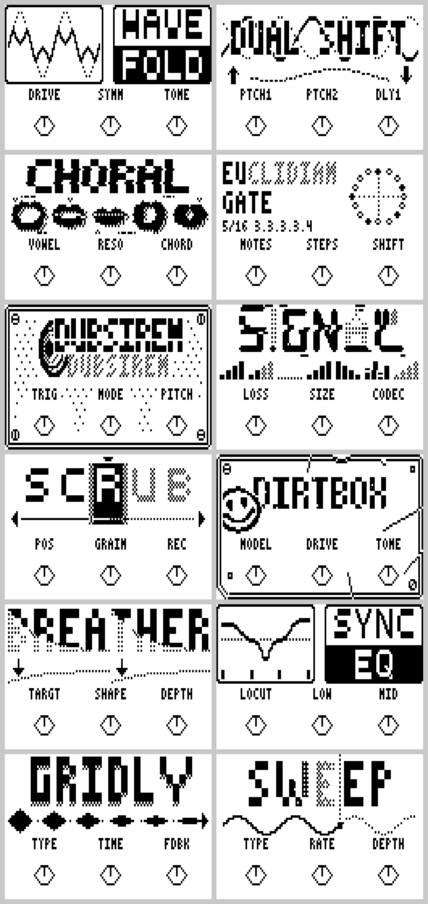

# Matujuice Zoom MS ZDL effects pack

Five free custom effects for Zoom MultiStomp pedals, with source code.



| Effect | What it is |
|---|---|
| **WaveFold** | Buchla-style wavefolder with automatic level matching. |
| **DualShft** | Two tempo-synced pitch shifters, each with its own echo time, and an LFO that bends them in opposite directions. |
| **Choral** | Turns the input into a vowel choir: five voices, 35 chords, 11 ways for the vowels to move. |
| **EuGate** | Euclidean rhythm gate. Steps and Notes up to 64 each, so polymeters are possible. Swing, Gap and Soft too. |
| **DubSiren** | A dub siren on the footswitch with a tape-style echo. The rate can sync to tempo. |
| **Scrub** | New, not yet tested on the pedal. Records the last 6 seconds; a knob moves a read head through them, and where you stop, the grain under the head loops forever (a freeze). |

Every knob is explained in [docs/EFFECTS.md](docs/EFFECTS.md).

Unofficial. Not affiliated with or endorsed by Zoom. Use at your own risk. Tested on a Zoom MS-60B running MS-50G firmware. The MS-70CDR, MS-50G and other MS pedals are untested, so reports are welcome.

## Demo
Each effect on an MS-60B, played with a Meeblip Triode and a Digitakt, then a short jam. Sound on.

https://github.com/user-attachments/assets/e6a70eba-e9a3-40d4-ad5b-9a042b79e75a

## Use the effects

Download the `.ZDL` files from the [Releases](../../releases) page, then follow [docs/INSTALLING-ZDLS.md](docs/INSTALLING-ZDLS.md) (Zoom Effect Manager, "Read Effects from folder").

## Build them yourself

You need Python 3 and the TI C6000 compiler (`ti-cgt-c6000_8.5.0.LTS`, free from Texas Instruments). The build scripts look for it in the usual places, or you can point `TI_CGT_ROOT` at the folder that contains `bin` and `include`.

On Windows, double-click one of:

- `build_wavefold.bat`
- `build_dualshft.bat`
- `build_formant.bat` (Choral; the folder and source keep the working name `formant`)
- `build_eugate.bat`
- `build_dubsiren.bat`

Scrub builds with `py build_all.py scrub` (output `dist/Scrub.ZDL`). Or run `py build_all.py` for all of them. The results are in `dist/`. `py make_release.py` then packs them with the readme and licence into `release/Matujuice_ZoomMS_pack.zip`.

## Layout

```
src/custom/<effect>/   the DSP (.c), manifest_pedal.json (knobs, defaults, ids), make_cover.py, build.py
src/airwindows/common/ shared cover and parameter helpers; covers/*.json are the generated covers
build/                 the ZDL linker and tools (from ZoomMultistompZDL, see below)
docs/                  how to install, plus the DSP rules these effects follow
```

To change a cover, edit that effect's `make_cover.py` and run it. It rewrites the cover JSON and a preview image. The pedal's pixels are 1.4 times taller than wide, so round shapes are drawn squashed.

Effect IDs used here: 480 DualShft, 485 DubSiren, 486 Choral, 487 WaveFold, 488 EuGate, 490 Scrub. They are unique inside this repo. If another effect on your pedal uses one of the same numbers, change `fxid` in that effect's `manifest_pedal.json` and rebuild.

## Credits

- Built on the toolchain from [themanro/ZoomMultistompZDL](https://github.com/themanro/ZoomMultistompZDL) (MIT, Copyright (c) 2026 Roman Rusinov). The `build/` folder and the install and DSP-rule docs come from there; the upstream repo has much more documentation.
- WaveFold's fold curve is from "Virtual Analog Buchla 259 Wavefolder" (Esqueda, Pontynen, Valimaki, Parker; DAFx-2017).
- The effects themselves are original work.

## Licence

MIT, see [LICENSE](LICENSE).
